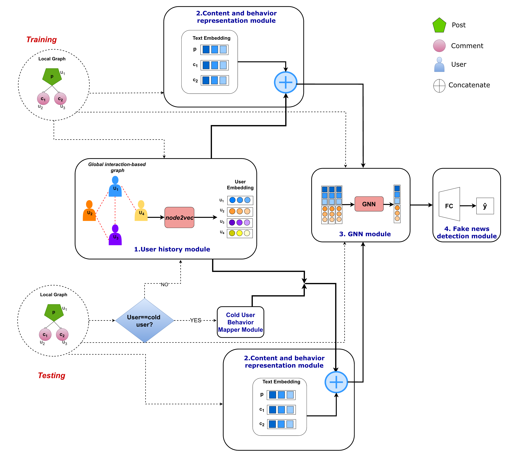

# Real-World Challenges in Fake News Detection: Dealing with Posts by Cold Users

Accepted at **ICWSM 2026**.

Sai Keerthana Karnam, Abhirup Kundu, Jashn Arora, Manish Jain, Animesh Mukherjee

---

## Abstract

Social media serves as a primary source of information in the current digital era. Many people consume a vast range of information in a very short span, yet, amidst the stream of genuine information, fake news and rumors continue to spread. The need for effective detection models is becoming increasingly critical. Past user behavior and user engagement on a post are strong signals that SOTA approaches leverage for fake news detection and other post classification tasks. However, these approaches lean too heavily on knowing this past behavior, and thus suffer from a cold user problem, or users that are new or have minimal footprint on the platform. In this paper, we make three core contributions. We first establish the value of user behavior, both content and user-user interactions, in the task of fake news and rumor detection. We then establish the extensive prevalence of cold users in the real-world datasets, and show the need for newer algorithms considering cold users. We next propose a novel socially-aware context representation scheme – USER EVIDENCE NETWORK (UEN) – to detect the spread of misinformation and unverified information while efficiently navigating this cold user challenge. We introduce techniques that approximate missing/absent behavior data of a new user from existing users’ interactions. By carefully addressing the cold user challenge, our work provides robust approaches targeting fake news and rumor detection for real-world platforms.

**Figure 1 : The overall architecture of the UEN framework. For *training*, first the global interaction-based graph is constructed and trained to generate user representation in the first module. These embeddings are passed to the second module, which captures content and user behavior features. These features are fed to the third module to obtain a robust graph representation, which is ultimately classified in the fourth module. For *testing*, each user in the sample is first checked to determine if they are a cold user. Cold user representation is obtained from the cold user behavior mapper module ; while other users’ representation is obtained from the first module. Remaining steps follow the training phase**.

---

---

## 📂 Dataset

This project uses two publicly available datasets for fake news detection: **Fakeddit** and **GossipCop**.

---

### Fakeddit Dataset

The primary dataset is obtained from:
🔗 https://github.com/entitize/Fakeddit

---

### GossipCop Dataset 

This dataset is accessed via:
🔗 https://github.com/safe-graph/GNN-FakeNewsv

---

## Contact

For any questions or issues, please contact: [saikeerthana00@gmail.com](mailto:saikeerthana00@gmail.com).
